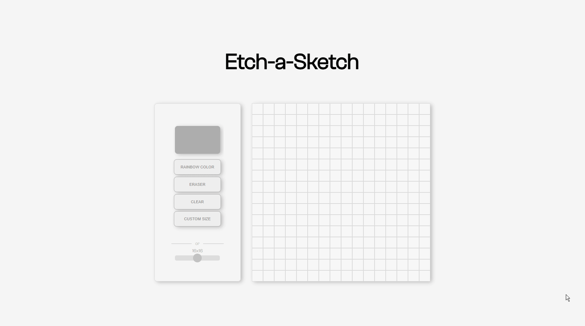

# Etch-a-Sketch 🎨

A browser-based Etch-a-Sketch drawing app built using **Vanilla
JavaScript**, **CSS**, and **Vite**.

## 🚀 Live Demo

https://etch-a-sketch-ivory.vercel.app/

------------------------------------------------------------------------

## 📌 Features

-   Dynamic grid generation
-   Hover drawing effect
-   Adjustable grid size
-   Clear/reset functionality
-   Color Picker

------------------------------------------------------------------------

## 🛠️ Tech Stack

-   HTML5
-   CSS3
-   JavaScript (ES Modules)
-   Vite

------------------------------------------------------------------------

## ⚙️ Installation

Clone the repository:

    git clone https://github.com/ryekram/etch-a-sketch.git
    cd etch-a-sketch

Install dependencies:

    npm install

Run development server:

    npm run dev

Build for production:

    npm run build

------------------------------------------------------------------------

## 📖 How It Works

-   A grid is dynamically generated using JavaScript.
-   Each cell listens to hover events.
-   When hovered, the cell changes color, simulating drawing.

------------------------------------------------------------------------

## 👤 Author

**Reymark Magsanay**

------------------------------------------------------------------------

## ⭐ Acknowledgements

Inspired by The Odin Project.
